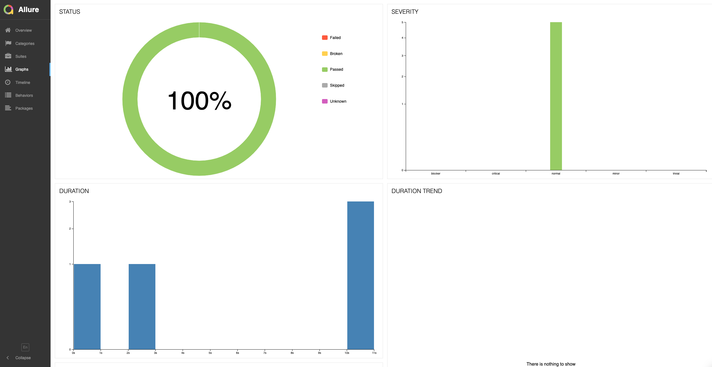
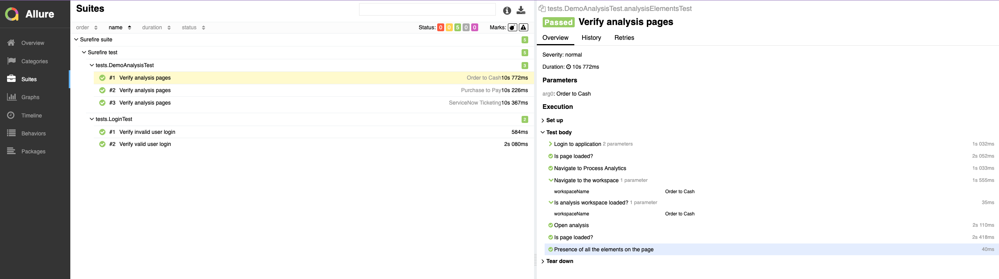

# celonis-tech-task

### Summary
Framework is build using the stack
* [Selenium 4](https://www.selenium.dev/)
* [Java 11](https://www.oracle.com/java/technologies/javase-jdk11-downloads.html)
* [TestNG](https://testng.org/doc/)
* [Allure report](https://docs.qameta.io/allure/)
   

### Project Pre-Installation

#### Dependency handling
All Dependencies handled by Maven

#### Required software to run tests from Command Line
* [Java 11](https://www.oracle.com/java/technologies/javase-jdk11-downloads.html)
* [Apache Maven 3](http://maven.apache.org/download.cgi)

### Test Project Build

#### Steps
1. Clone the repository.
2. Go to ***celonis-tech-task*** folder.

#### Test run configuration
***general.properties***

    url.base = https://applications.eu-1.celonis.cloud
    browser = chrome
    timeout = 30
 

### Steps to run tests
1. Go to ***celonis-tech-task*** folder.
2. Use the below command to run the TestNG tests

        mvn clean test
3. Generate test report
        
        mvn allure:report

##### Dashboard

##### Test report

### Plan to orchestrate continuously
1. Setup Jenkins, Circle-CI or Git-hub actions job to run automation tests continuously 
2. In order to run them on CI need to provide capability to run tests in headless mode 
3. Set up [Selenium grid](https://www.selenium.dev/documentation/grid/) to distribute automation tests
   across different platforms and browser combination
4. Dockerized Selenium grid setup